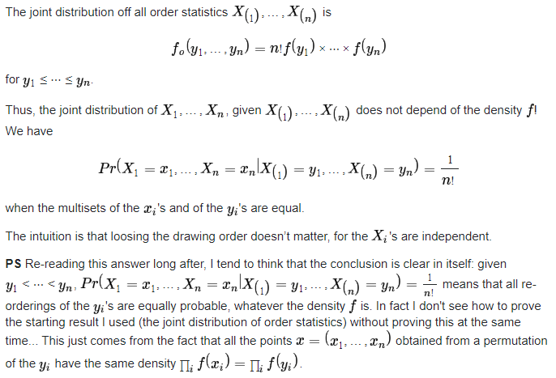
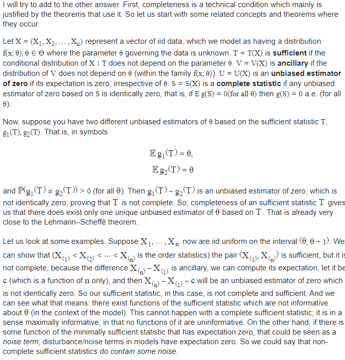
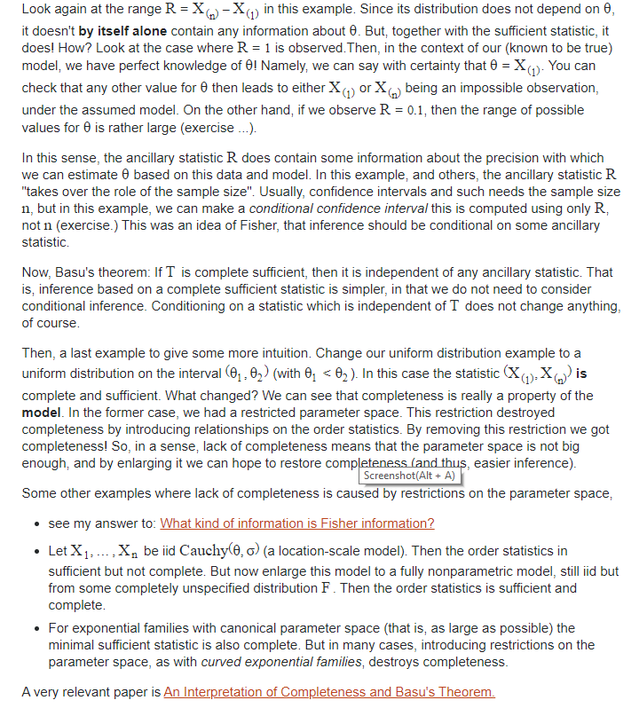

#### Chapter 6: Principle of data reduction
##### Sufficiency principle
If $T(x)$ is a suffucient statistic for $\theta$, then any inference about $\theta$ should depend on the sample on the sample $X$ only through the calue $T(x)$
##### Definition for sufficient statistic
$T(x)$  is a sufficient statistic for $\theta$ if the coditional distribution of sample $X$n given the value of $T(x)$ does not depend on $\theta$.
- Intuition under the definition: Given a data sample, if the only information we want to know is just $\theta$. Then a person who knowns all the data($X$) have the same amount of knowledge of $\theta$ as a person who only knowns $T(x)$.
- Example: 1. Sample sum is a ss for $\theta$ of  $B(n,\theta)$.
##### Why order statistics are sufficient to an unknown pdf $f$

##### Factorization Theorem
Let $f(x|\theta)$ be the pdf of sample $X$, $T(x)$ is a ss for $\theta$ iff there exists $g(T(x)|\theta),h(x)$ such that
$$
f(x|\theta)=g(T(x)|\theta)h(x)
$$ 
- Intuition: ss means that $\theta$ exert influence on the populatiuon $X$ only through $T(X)$, while this theorem implies that the joint pdf of a population provides a channel for us to measure this connection. For a population, we can split its joint pdf into two parts where the first one characterize the relationship of  $\theta$ and $T(X)$, and the other part is totally independent of $\theta$. This is a mathematical characteristic of how  $\theta$ exert influence on the populatiuon $X$ only through $T(X)$.
- If $\theta$ is a vector, so does $T(x)$.
- A one-to-one mapping of a ss is also a ss.
- Minimal ss: $T(x)$ is a minimal ss iff for every two  sample points $x,y$,$\frac{f(x|\theta)}{f(y|\theta)}$ is a const iff $T(x)=T(y) $.(A minimal ss is a statistic that has achieved the maximal amount of data reduction possible while still retaining all the informatin about the parameter $\theta$).
##### Ancillary stats definition
Does not depend on the parameter $\theta$ is called an as.
- A location family: the range of a sample is as
- A scale family: $\frac{X_1}{X_2},...,\frac{X_{n-1}}{X_n} $ is as.
- as is not indep of ss. See Eg 6.2.20
##### An intuitive and interesting way to see completeness.
Defition of complete: Let $f(t|\theta)$ be a family of pdfs or pmfs for a statistic $T(X)$. The family of probability  distributions is called complete if $E_{\theta}g(T)=0$ for all $\theta$ implies $P_{\theta}(g(T)=0)=1$ for all $\theta$. Equivalently, $T(X)$ is called a complete statistic.
- Understanding. The condition of complete simply says that if one can find a function of $T$ which is an unbiased estimator of 0( which is a white noise), then this function can only take the form that it's $0$ a.e. In other words, except this extreme way of constructing functions, you cannot find a function of $T$ that is a white noise. It means that $T$ is highly informative and it's hard to find a transformation of it that is useless. Thus complete means that a statistic is a really good one. Actually the word "complete" here means pure and the most concentrated.
The following is another way to put it.

