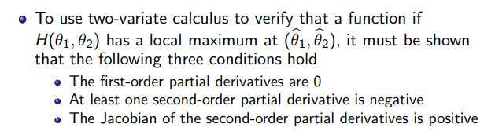
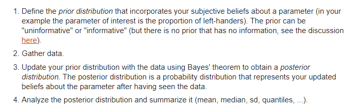

##### Point estimator definition:
Any function of a sample is a point estimate; Any staticstic is a point estimator.
##### Method of Moments
Equating the first $k$ sample moments to the corresponding $k$ population momo=ents and solving the resulting systemf of simultaneous equations.
- Pros: Always provide an estimator;Somestimes helpful.
- Cons: Might occur range of estimator and range of parameter does not coincide thus draw unreasonable estimation.
##### Maximum Likelihood Estimators
$$
\max_{\theta} L(\theta|x )=\Pi_{i=1}^n f(x_i|\theta)
$$
Pros: Range of MLE always coincides with the range of parameters. Also satisfy some optimal condition.
Cons: Sensitivity problem; Maximum problem might be hard to solve.
- Invariance Property: If $\hat{\theta}$ is the MLE of $\theta$, then for any function $\tau(\theta)$, the MLE  of $\tau(\theta)$ is $\tau(\hat{\theta})$
- Two variate calculas:

Notice that the second and third condition guarantees that the Hessian matrix is negatice-definite matrix, thus the function is a concave one, thus the maximum is obtained.
##### Bayesian Estimator
Some steps in Bayesian estimation:

- Conjugate family: A class $\Pi$ of prior distributions is a conjugate family of $F$ if the posterior distribution is in the class $\Pi$  for all $f\in F, x\in X$ and all priors in $\Pi$.
The definition of conjugate family make sure that the prior and posterior is in the same distribution family. Some examples: Binomial and beta family; Multinomial distribution and Dirichlet priors; Poisson distribution and gamma priors.
What's interesting is that the posterior estimator is usually a combination of the prior estimation and the data's information. For Normal distribution, It's of the form:
$$
E[\theta|x]=\frac{\tau^2}{\tau^2+\sigma^2}x+\frac{\sigma^2}{\tau^2+\sigma^2}\mu, Var[\theta|x]=\frac{\sigma^2\tau^2}{\tau^2+\sigma^2}
$$
Where $X-N(\theta,\sigma^2),\theta-N(\mu,\tau^2)$.