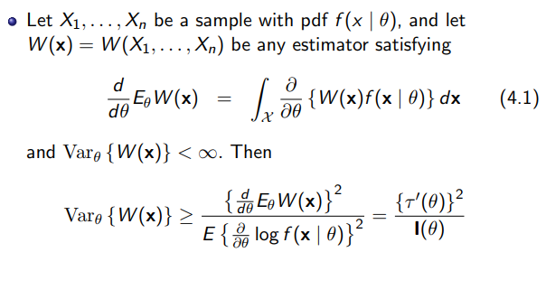
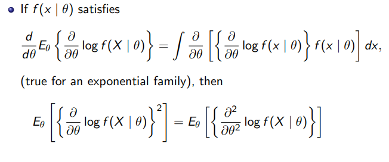
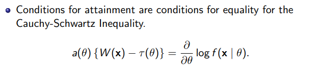

##### Point estimator definition:
Any function of a sample is a point estimate; Any staticstic is a point estimator.
##### Method of Moments
Equating the first $k$ sample moments to the corresponding $k$ population momo=ents and solving the resulting systemf of simultaneous equations.
- Pros: Always provide an estimator;Somestimes helpful.
- Cons: Might occur range of estimator and range of parameter does not coincide thus draw unreasonable estimation.
##### Maximum Likelihood Estimators
$$
\max_{\theta} L(\theta|x )=\Pi_{i=1}^n f(x_i|\theta)
$$
Pros: Range of MLE always coincides with the range of parameters. Also satisfy some optimal condition.
Cons: Sensitivity problem; Maximum problem might be hard to solve.
- Invariance Property: If $\hat{\theta}$ is the MLE of $\theta$, then for any function $\tau(\theta)$, the MLE  of $\tau(\theta)$ is $\tau(\hat{\theta})$
- Two variate calculas:

Notice that the second and third condition guarantees that the Hessian matrix is negatice-definite matrix, thus the function is a concave one, thus the maximum is obtained.
##### Bayesian Estimator
Some steps in Bayesian estimation:

- Conjugate family: A class $\Pi$ of prior distributions is a conjugate family of $F$ if the posterior distribution is in the class $\Pi$  for all $f\in F, x\in X$ and all priors in $\Pi$.
The definition of conjugate family make sure that the prior and posterior is in the same distribution family. Some examples: Binomial and beta family; Multinomial distribution and Dirichlet priors; Poisson distribution and gamma priors.
What's interesting is that the posterior estimator is usually a combination of the prior estimation and the data's information. For Normal distribution, It's of the form:
$$
E[\theta|x]=\frac{\tau^2}{\tau^2+\sigma^2}x+\frac{\sigma^2}{\tau^2+\sigma^2}\mu, Var[\theta|x]=\frac{\sigma^2\tau^2}{\tau^2+\sigma^2}
$$
Where $X-N(\theta,\sigma^2),\theta-N(\mu,\tau^2)$.
#### Method of Evaluating Estimates
##### MSE
Definition: An estimator $W$ of parameter $\theta$  is the function of $\theta$ defined by $E_{\theta}(W-\theta)^2$.
$$
E_{\theta}(W-\theta)^2=Var_{\theta}W+(E_{\theta}W-\theta)^2=Var_{\theta}W+(Bias_{\theta}W)^2
$$
We call an estimator is unbiased if $E_{\theta}W=\theta$. In this case, the MSE is just the variance of $W$.
##### Notice
- MSE is just a measurement we use to judge whether an estimator is better than the other, it has its flaws, for example, it tends to be forgiving of underestimation in the scale case(suppose you're estimating a variance, $σ^2$. Then, if you consciously underestimate the quantity your MSE can be at most $σ^4$, while overestimation can produce an MSE that far exceeds $σ^4$, perhaps even by an unbounded amount). Another flaw is that when the data has many outliers, then the estimator can be very sensitive to these outliers. Even though, this partial information can provide with us some guidelines for choosing between estimators.
- A scenario MSE can be useful is when facing a class of equivariante estimators.
##### Best Unbiased Estimators
The motivation is that there is no best MSE estimator since the space is too large. In this part, we focus on those who are unbiased. Try to find the one with the smallest variance.
- "Best" is defined in the following way: An estimator $W^*$ is an unbiased best estimator of $\tau(\theta)$ if it satisfies $E_{\theta}W^*=\tau(\theta)$, also, it's the one with the smallest variance.

Since finding the best unbiased estimator is hard, two ways are explored to achieve this goal: 
(1) The first one is give the variance a lower bound and if we manage to find an estimator whose variance is just equal to the lower bound, then the best is found; 
(2) Use the ss and cs we defined in chapter 6 and build a relationship of best estimator and cs.
##### Cramer-Rao Inequality

The first condition just says that integration and derivative operation can be interchanged. The proof is by Cauchy-Schwarz ineq:
$$
[Cov(X,Y)]^2\leq(VarX)(Var Y)
$$
where $X$ to be the estimator $W(X)$. 
An useful lemma to simplify computation:

Then there is this corallay that helps us determine when this lower bound can be achieved.

