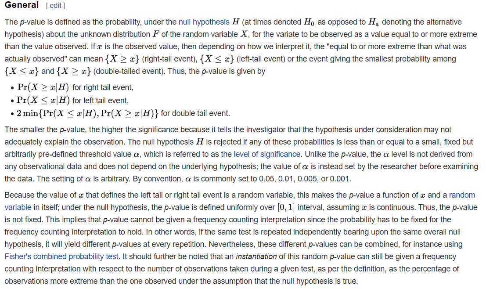

### Chapter 8 Hypothesis Testing
#### Motivation
In previous chapters, we discussed about the statistics of a population. This chapter provides an application of those stats theory we mentioned before. In real life, people wants to draw some useful conclusion with the data drawn from a certain population. If we put it by statistical language, these claims are in the form of hypothesis and it's the statistician's job to test  whether it's true. Usually, statistics function as a medium tool to achieve this goal. Therefore, this chapter consists of two parts:
- Methods for finding tests 
- Methods for evaluating estimators

The first part provides methods to construct test procedures using different ideas. It's made up of three parts: LRT; Bayesian; and Union-Intersection(or Intersection-Union) Tests. Different method applies to different scenarios.
#### Methods for finding tests
- Hypothesis. In statistics one always works with two hypothesis that a statistical test should reject or not reject. There is the null hypothesis, that will not be rejected until sample evidence against it is strong enough. There is also the alternative hypothesis, the one we will take if the null seems to be false.
##### Likelihood Ratio Test
Definition: The likelihood ratio test  for testing $H_0:\theta\in \Theta_0$ versus $H_1:\theta\in \Theta_0^c$ is 
$$
\lambda(x)=\frac{\sup_{\Theta_0}L(\theta|x)}{sup_{\Theta}L(\theta|x)}
$$
A LRT is any test that has a rejection region of the form $\{x:\lambda(x)\leq c\}$ where $c$ is any number satisfying $0\leq c\leq 1$.
- Remarks:The intuition behind LRT is that The denominator denotes the largest likelihood of the observed $x$ is drawn from a distribution where the parameter lies in $\Theta_0$. The nominator denotes which of the whole param space. Therefore, the LR lies between 0 and 1.The number small implies that $H_0$ is a hypothesis is one that is not likely to be true, while large implies the contrary.
Example 8.2.3 is an interesting application of the method.

 (Relationship with ss)
 Theorem: If $T(x)$ is a ss for $\theta$ and $\lambda^*(t)$ and $\lambda(x)$ are the LRT stats based on $T$ and $X$ respectively. Then $\lambda^*(T(X))=\lambda(X)$ for all $X$ in the sample space.
 - This theorem is another extension of ss theory. It's not a surprising result since a stats is ss means it contains all the useful information about a param already thus this is just a verification of this property in the test theory.
##### Bayesian Tests
The Bayesian method regards the param as an r.v and has a distribution for itself. Before the observation about $X$ is obtained, it has a prior distribution and with $X$ we update the prior and get a posterio distribution $\Pi(\theta|x)$ about the param. With $\Pi$, we can compute $P(\theta\in \Theta_0|x),P(\theta\in \Theta^c|x)$. If $P(\theta\in \Theta_0|x)\geq P(\theta\in \Theta^c|x)$, we accept $H_0$ otherwise the reverse.
##### Union-Intersection(or Intersection-Union) Tests
This test method applies to the case where $H_0$ is the intersection (or union) of a set of expression. If 
$$
H_0:\theta\in \displaystyle\cap_{\gamma\in\Gamma}\Theta_{\gamma}(\text{or }H_0:\theta\in \displaystyle\cup_{\gamma\in\Gamma}\Theta_{\gamma})
$$
Suppose the rejection region for the test $H_{0\gamma}$ is $\{x:T_{\gamma}(x)\in R_{\gamma}\}$. Then the rejection region for the U-I is 
$$
\cup_{\gamma\in\Gamma}\{x:T_{\gamma}(x)\in R_{\gamma}\}(\text{or }\cap_{\gamma\in\Gamma}\{x:T_{\gamma}(x)\in R_{\gamma}\})
$$
#### Methods for evaluating tests
Given a test procedure, we are able to give a accept/reject answer to $H_0$ with the data on hand. Notice that a test is just a specified rejection region. We want to build a frame to evaluate whether a test is good or not. Thus, the concept "uniformly most powerful tests(UMP)" is proposed. And the following NP-Theorem, Karlin-Rubin theorem are all criterions for verifying or help finding a most powerful tests
##### Definitions
- **Rejection region**, given all possible outcomes of the test, the rejection region includes those outcomes that will make us reject the null hypothesis in benefit of its alternative one.
- **Power function**:The power function of a hypothesis test with rejection region $R$ is the function of $\theta$ defined by $\beta(\theta)=P_{\theta}(X\in R)$
- **Power of a test**($1-P(Type I error) $) (a.k.a. sensitivity) tells us which proportion of times we will correctly reject the null hypothesis when it is wrong. We want powerful tests, so most of the time we reject the null hypothesis we are right!
- **Significance level**($P(Type Ierror)$) of a test (a.k.a. false positive rate) tells us which proportion of times we will wrongly reject the null hypothesis when it is true. We want a small significance level so most of the times we reject the null hypothesis we are not wrong!
- **Likelihood** is the probability of having seen the observed outcome of the test given that the null hypothesis (Likelihood of the null hypothesis) or the alternative one (Likelihood of the alternative hypothesis) were true.
- **Likelihood ratio**(Notice this is not the same as the LRT definition and this ratio is used in the explanation of NP-thm) is the ratio of the alternative hypothesis likelihood divided by the null hypothesis likelihood. If the test outcome was very much expected if the null hypothesis were true versus the alternative one, the likelihood ratio should be small.
- **size $\alpha$**: a test with power function $\beta(\theta)$ is a size $\alpha$ if $sup_{\theta\in \Theta_0}\beta(\theta)=\alpha$. Notice this is just the *type I probability*.
- **UMP**: In a class of tests that have the same type I probability, the test with the lowest type II error probability is called an UMP.
NP-Thm gives a sufficient and necessary condition for UMP tests when the null hypo and alternative hypo are composed of only 1 point.https://stats.stackexchange.com/questions/144998/neyman-pearson-lemma is a really good interpretation of this theorem. In summary, the idea of NP-thm for this two-point hypo test is to construct the rejection region in this manner: By the Likelihood ratio we defined above, we first put the outcome with the highest LR ratio into the region, then the second highest and so on. The rational behind it is to make sure with the same significance level $\alpha$ , we get the most powerful test can be got. The condition in  the theorem $\frac{f(x|\theta_0)}{x|\theta_0}$ provides a method to  measure "high".
Karlin-Rubin can be seen as an extension of NP on composite hypos. But monotonicity of LR ratio has to be checked first before applying the theorem.
#### p-values
