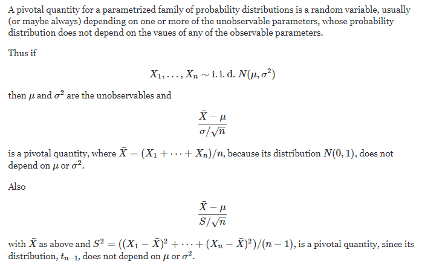
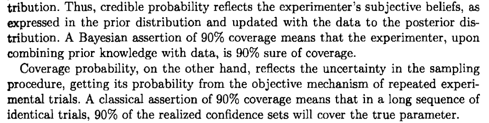
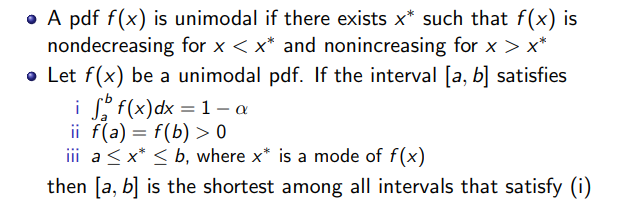

### Chapter 9: Interval Estimation
One problem about point estimation is that the probability that the true param equals to estimation is 0. Though with high precision, this is a property we do not desire. In interval estimation, instead of one point estimators, an estimation interval is suggested to estimate the range of the true param. That is to say, the estimation result is an interval under this method. Though we lost the precision, we can get a high probability that the true params lies in our interval. So it's a tradeoff.
#### Definitions
- *Interval Estimate*: $L(x),U(x)$ are a pair of functions that satisfy $L(x)\leq U(x)$ for all $x\in X $. The random inteval $[L(x),U(x)]$ is called an interval estimator.
- *Coverage Probability*:$=\inf_{\Theta}P_{\theta}(\theta\in[L(x),U(x)])$ The infimum of the probility that the random interval $[L(x),U(x)]$ will cover the parameter $\theta$. 
Comment on this definition: Notice the "inf" notation is taken on the full space of param $\theta$. The param is fixed but unknown, though in most situations the coverage probability is not related to $\theta$, however, in some situation, the coverage is relevant to $\theta$ (Eg 9.1.6). In those relevant cases, we take an infimum of the probability on the whole space of $\theta$ therefore we can say that we at least(from inf) have $\alpha$ probability that our interval covers the true param. Even though in some extreme cases, the interval cannot covers the param, but what this definition concerns is a lower bound on the probability of coverage.
#### Methods of Finding Interval Estimators
The core of interval construction is closely related to hypothesis testing. First define two sets, based on which we propose the central theorem behind all the interval construction.
Define $A(\theta_0)$ be the acceptance region of a level $\alpha$ test of $H_0:\theta=\theta_0$. For each $x\in X$, define a set $C(x)$ in the parameter space by
$$
C(x)=\{\theta_0:x\in A(\theta_0)\}
$$
*Theorem*
The random set $C(X)$ is a $a-\alpha$ condidence set. Conversly. If $C(X)$ is a $a-\alpha$ condidence set, for any $\theta_0\in \Theta$, $A(\theta_0)$ is the acceptance region of a level $\alpha$ test of $H_0:\theta=\theta_0$.
- Remarks: This theorem builds a brigde between interval's confidence coefficient and a test's level. Notice that the essence of inverting a test into an interval is to interpret $P_{\theta_0}(x\in A(\theta_0))\geq 1-\alpha$ into $P_{\theta_0}(\theta_0\in C(x))\geq 1-\alpha$. 
Read Eg 9.2.3,9.2.5
#### Pivotal Quantities
*Definition*: a random variable $Q(x,\theta)$  is a pivotal quantities if the distribution of $Q()$ is independent of all parameters.

#### Bayesian Intervals
In the Bayesian prospective, the parameter to be estimated is not fixed and follows a certain distribution. Thus  the understanding of coverage probability is different from what has been discussed before. The experimentor first has a prior knowlegdge about the param then update his knowledge based on the data observed. If posterior distribution of $\theta$ given $X=x$, then for any set $A\in \Theta$, the credible probability of $A$ is 
$$
P(\theta\in A|x)=\int_{A}\pi(\theta|x)d\theta
$$
and $A$ is a credible set for $\theta$.
**Coverage probability and credible probability**:

### Methods of Evaluating Interval Estimators
#### Size and coverage probability
This is for a given specified coverage probability find the confidence interval with the shortest length. A result for unimodal pdf:
